---
## Front matter
title: "Лабораторная работа №2"
subtitle: "Архитектура вычислительных систем"
author: "Шурова Анастасия Михайловна"
## Generic otions
lang: ru-RU
toc-title: "Содержание"

## Bibliography
bibliography: bib/cite.bib
csl: pandoc/csl/gost-r-7-0-5-2008-numeric.csl

## Pdf output format
toc: true # Table of contents
toc-depth: 2
lof: true # List of figures
lot: true # List of tables
fontsize: 12pt
linestretch: 1.5
papersize: a4
documentclass: scrreprt
## I18n polyglossia
polyglossia-lang:
  name: russian
  options:
	- spelling=modern
	- babelshorthands=true
polyglossia-otherlangs:
  name: english
## I18n babel
babel-lang: russian
babel-otherlangs: english
## Fonts
mainfont: PT Serif
romanfont: PT Serif
sansfont: PT Sans
monofont: PT Mono
mainfontoptions: Ligatures=TeX
romanfontoptions: Ligatures=TeX
sansfontoptions: Ligatures=TeX,Scale=MatchLowercase
monofontoptions: Scale=MatchLowercase,Scale=0.9
## Biblatex
biblatex: true
biblio-style: "gost-numeric"
biblatexoptions:
  - parentracker=true
  - backend=biber
  - hyperref=auto
  - language=auto
  - autolang=other*
  - citestyle=gost-numeric
## Pandoc-crossref LaTeX customization
figureTitle: "Рис."
tableTitle: "Таблица"
listingTitle: "Листинг"
lofTitle: "Список иллюстраций"
lotTitle: "Список таблиц"
lolTitle: "Листинги"
## Misc options
indent: true
header-includes:
  - \usepackage{indentfirst}
  - \usepackage{float} # keep figures where there are in the text
  - \floatplacement{figure}{H} # keep figures where there are in the text
---

# Цель работы

Изучение идеологии и применения средств контроля версий.Приобретение практических навыков по работе с системой git.

# Задание

1. Создайте отчет по выполнению лабораторной работы в соответствующем
каталоге рабочего пространства (labs>lab03>report).
2. Скопируйте отчеты по выполнению предыдущих лабораторных работ в
соответствующие каталоги созданного рабочего пространства.
3. Загрузите файлы на github.

# Выполнение лабораторной работы

Описываются проведённые действия, в качестве иллюстрации даётся ссылка на иллюстрацию (рис. [-@fig:001])

1)Создаём учётную запись на сайте https://github.com/ и создаём учётную запись и заполняем основные данные.

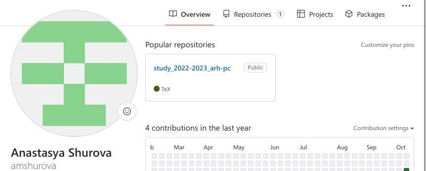{ #fig:001 width=90% }

Описываются проведённые действия, в качестве иллюстрации даётся ссылка на иллюстрацию (рис. [-@fig:002])

2) Делаем предварительную конфигурацию git. Для этого открываем терминал и вводим следующие команды. Указываем имя и e-mail владельца репозитория.

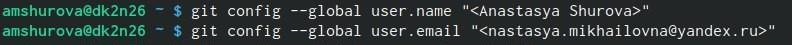{ #fig:002 width=90% }

Описываются проведённые действия, в качестве иллюстрации даётся ссылка на иллюстрацию (рис. [-@fig:003])

3) Затем настраиваем utf-8, autocrlf, safecrlf.

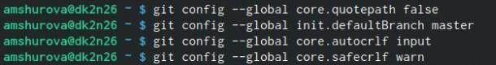{ #fig:003 width=90% }

Описываются проведённые действия, в качестве иллюстрации даётся ссылка на иллюстрацию (рис. [-@fig:004])

4) Для последующей идентификации пользователя на сервере репозиториев необходимо сгенерировать пару ключей, которые сохранятся в каталоге ~/.shh/.

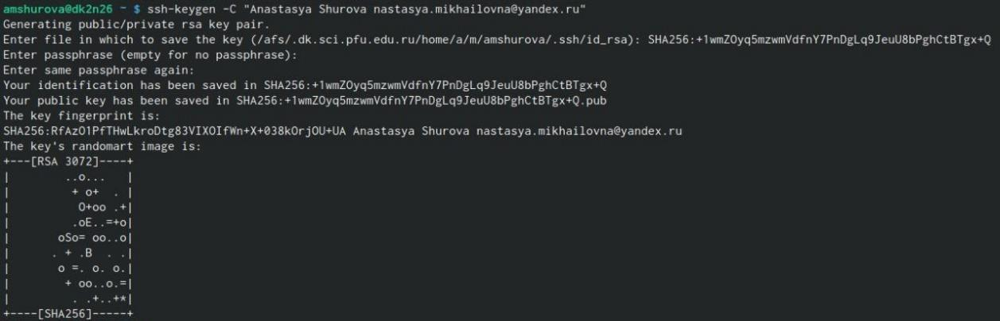{ #fig:004 width=90% }

Описываются проведённые действия, в качестве иллюстрации даётся ссылка на иллюстрацию (рис. [-@fig:005])

5) Для того чтобы загрузить сгенерированный открытый ключ нужно зайти на сайт GitHub под своей учётной записью и перейти в меню setting. Далее выбираем в боковом меню SSH and GPG keys и нажимаем кнопкуNew SSH key. Копируем ключ из локальной консоли в буфер обмену. Затем вставляем ключ в появившееся на сайте поле и называем Title.

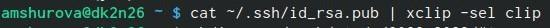{ #fig:005 width=90% }

5.1)Описываются проведённые действия, в качестве иллюстрации даётся ссылка на иллюстрацию (рис. [-@fig:006])

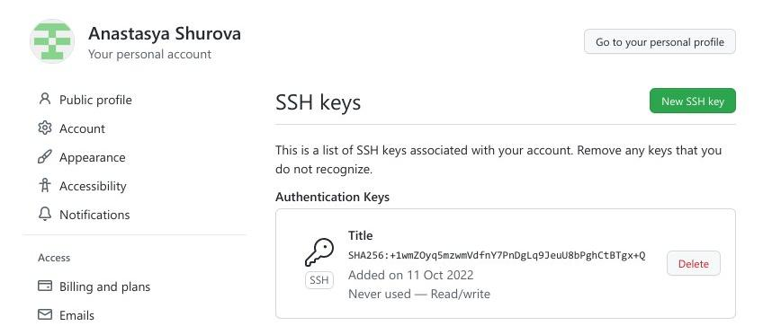{ #fig:006 width=90% }

Описываются проведённые действия, в качестве иллюстрации даётся ссылка на иллюстрацию (рис. [-@fig:007])

6) Открываем терминал и создаём каталог для предмета «Архитектура компьютера»

{ #fig:007 width=90% }

7) Создаём репозиторий на основе шаблона через web- интерфейс GitHub:

Описываются проведённые действия, в качестве иллюстрации даётся ссылка на иллюстрацию (рис. [-@fig:008])

7.1) Переходим на страницу репозитория с шаблоном курса https://github.com/yamadharma/course-directory-student-template

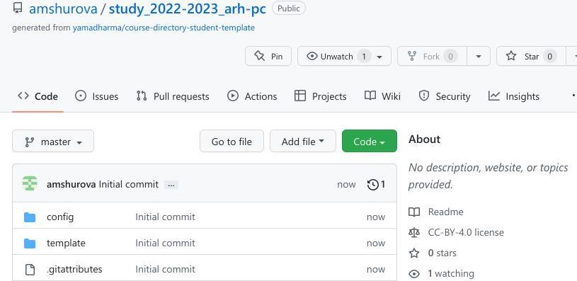{ #fig:008 width=90% }

7.2) Далее нажимаем Use this template

Описываются проведённые действия, в качестве иллюстрации даётся ссылка на иллюстрацию (рис. [-@fig:009])

7.3) В открывшемся окне задаём имя репозитория и создаём его

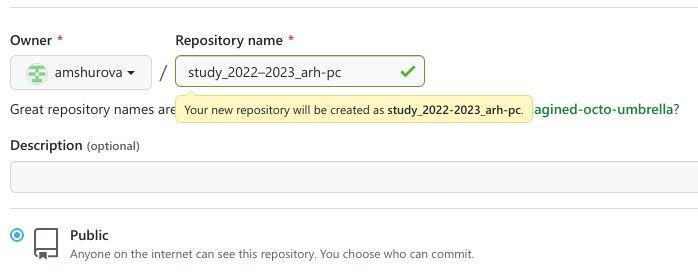{ #fig:009 width=90% }

Описываются проведённые действия, в качестве иллюстрации даётся ссылка на иллюстрацию (рис. [-@fig:010])

8) Открываем терминал и переходим в каталог курса

{ #fig:010 width=90% }

Описываются проведённые действия, в качестве иллюстрации даётся ссылка на иллюстрацию (рис. [-@fig:011])

9) Копируем созданный репозиторий с помощью клонирования, нажав Code -< SSH

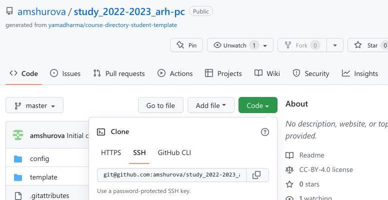{ #fig:011 width=90% }

Описываются проведённые действия, в качестве иллюстрации даётся ссылка на иллюстрацию (рис. [-@fig:012])

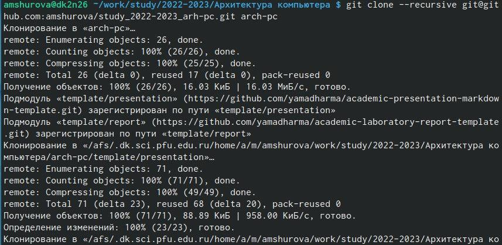{ #fig:012 width=90% }

Описываются проведённые действия, в качестве иллюстрации даётся ссылка на иллюстрацию (рис. [-@fig:013])

10) Переходим в каталог курса, создаём необходимые каталоги.

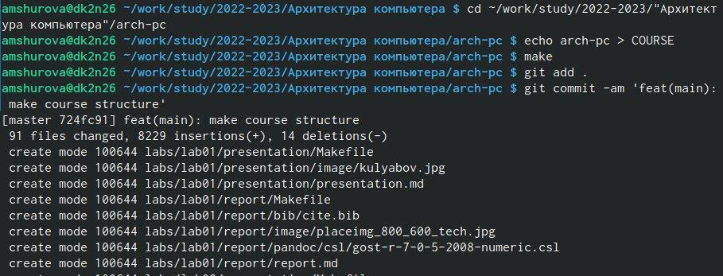{ #fig:013 width=90% }

Описываются проведённые действия, в качестве иллюстрации даётся ссылка на иллюстрацию (рис. [-@fig:014])

11) Отправляем файлы на сервер.

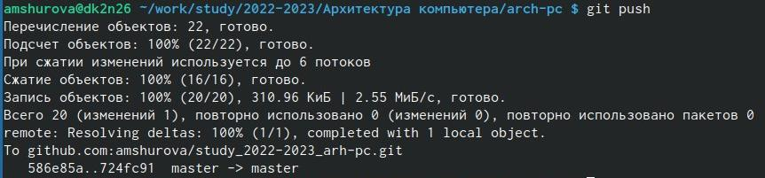{ #fig:014 width=90% }

Описываются проведённые действия, в качестве иллюстрации даётся ссылка на иллюстрацию (рис. [-@fig:015])

12) Проверяем правильность создания иерархии рабочего пространства в локальном репозитории и на странице GitHub.

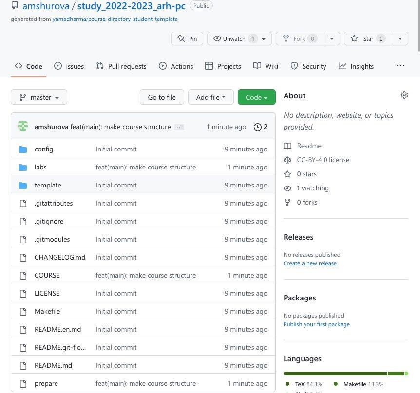{ #fig:015 width=90% }

# Выводы

В ходе выполнения лабораторной работы я изучила идеологию и применение средств контроля версий. Приобрела практические навыки по работе с системой git.

# Список литературы{.unnumbered}

::: {#refs}
:::
